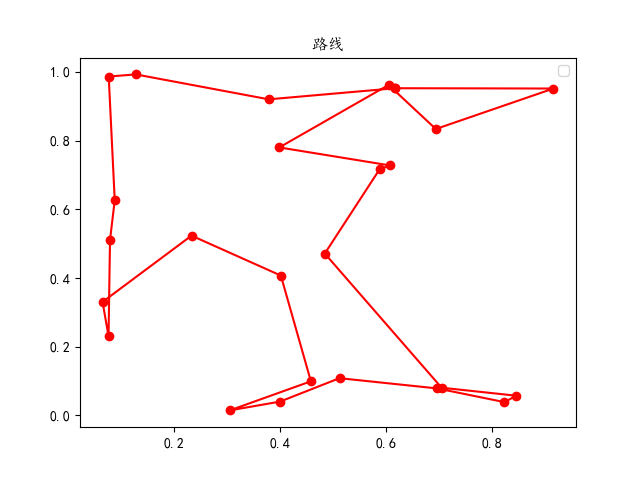
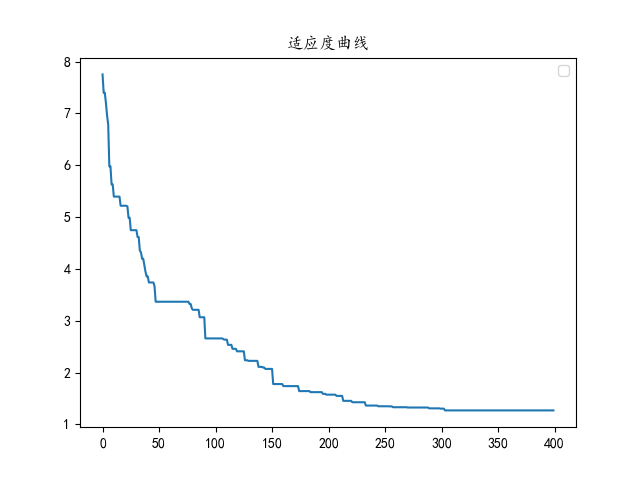

# 遗传算法解决旅行商（TSP）问题
## 参考视频地址
<https://www.bilibili.com/video/BV17Z4y1w7qF>
## 参考项目
<https://github.com/zifeiyu0531/ga-tsp>
## 效果
* 输入：
```python
# 城市坐标列表
[[0.34373988 0.28799359]
 [0.59614005 0.20891475]
 [0.31594294 0.24015942]
 [0.00445381 0.27850897]
 [0.72902031 0.02892819]
 [0.8927462  0.72593335]
 [0.69496064 0.49234185]
 [0.13480979 0.80326909]
 [0.09446444 0.74511812]
 [0.00322167 0.83702802]
 [0.13020064 0.52840454]
 [0.42933579 0.8439443 ]
 [0.23382182 0.40566047]
 [0.76388352 0.75707397]
 [0.55766312 0.403058  ]
 [0.18937066 0.0122916 ]
 [0.19229783 0.33401292]
 [0.10528408 0.39235952]
 [0.037418   0.04081298]
 [0.38220903 0.65365966]
 [0.2893925  0.3846537 ]
 [0.38730741 0.20597485]
 [0.18536116 0.34750257]
 [0.69820574 0.16041619]
 [0.31628208 0.50875925]]
```
* 输出：

    

    
## 代码结构
```
constant.py：各参数配置
ga.py：遗传算法实现
main.py：程序入口，数据预处理，效果展示
distMat: 初始化城市位置、距离矩阵
myPlot： 画图
```
## 环境
* 语言：`python3.8.10`
* 数据处理：`numpy`
* 数据可视化：`matplotlib`
## 使用
1. clone到本地
2. 准备环境
3. 运行main.py